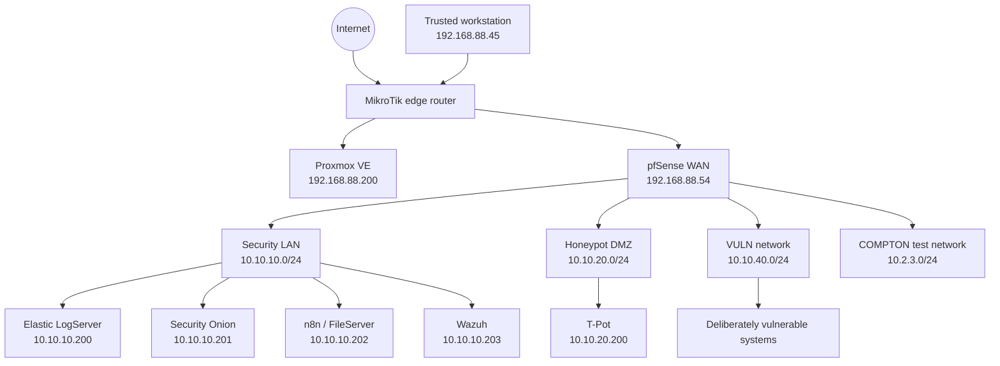
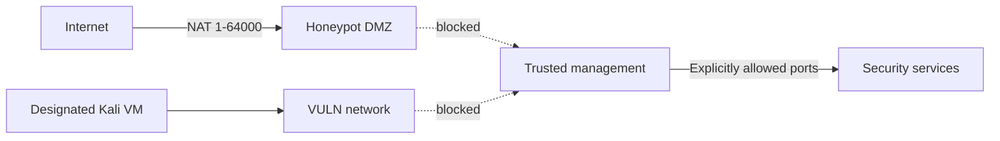
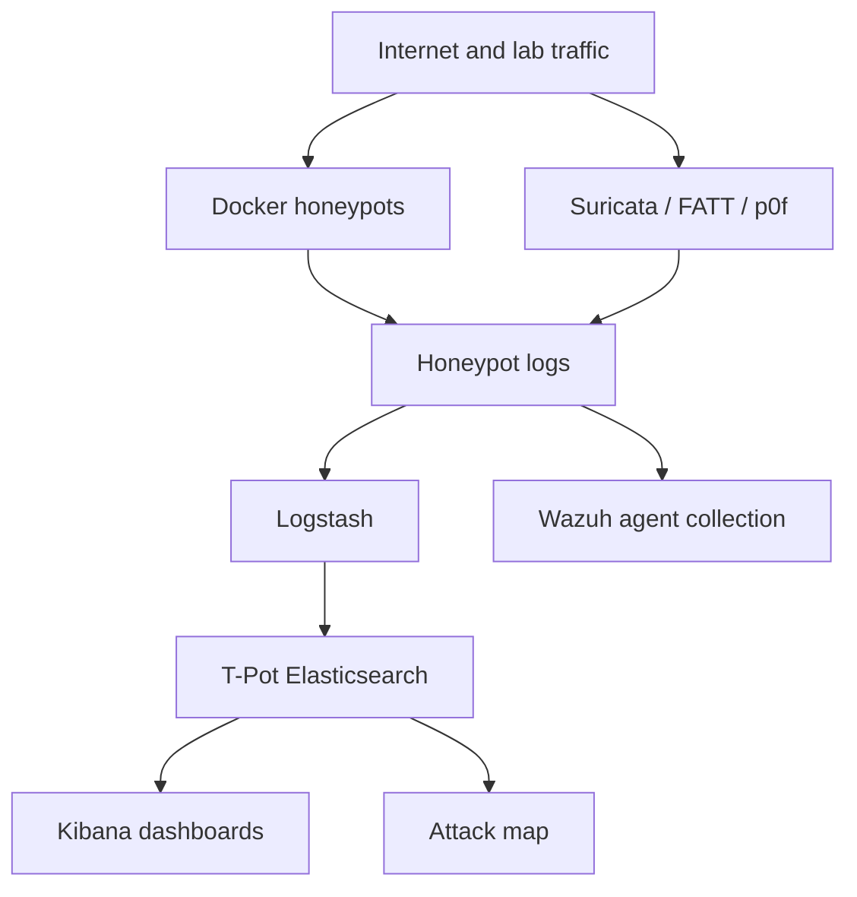
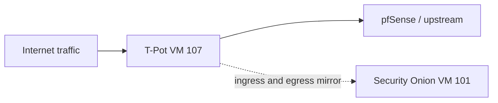
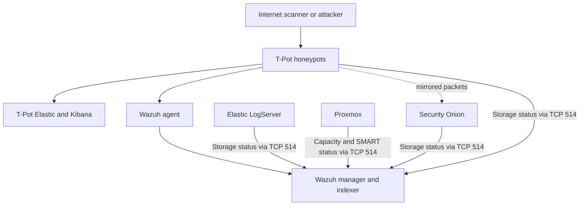

# LearningLab01 — Home Cybersecurity Operations Lab

[](https://www.proxmox.com/)
[](https://www.pfsense.org/)
[](https://github.com/telekom-security/tpotce)
[](https://wazuh.com/)
[](https://securityonionsolutions.com/)
[](https://www.elastic.co/)

## Overview

**LearningLab01** documents a segmented, Internet-connected home cybersecurity lab built for practical blue-team learning, defensive engineering, telemetry development, honeypot research, network monitoring, and controlled offensive-security exercises.

The environment combines:

- A **MikroTik** edge router
- A **Proxmox VE** virtualization host
- A virtualized **pfSense** firewall and router
- A **T-Pot Standard** multi-honeypot deployment
- A standalone **Wazuh** SIEM/XDR deployment
- A standalone **Elastic Stack** log server
- **Security Onion** for network security monitoring
- **Suricata**, **Zeek**, **FATT**, and **p0f** network telemetry
- **n8n** automation and Samba file services
- An isolated **VULN** network for deliberately vulnerable targets
- Dedicated HDD-backed repositories for logs, artifacts, and snapshots
- Centralized storage-capacity and physical-disk health alerting through Wazuh

This repository is intentionally documentation-focused. It records the architecture, controls, data flows, operational procedures, and learning objectives of the lab. It does **not** contain credentials, private keys, public IP addresses, certificates, captured malware, raw attack data, or production configuration exports.

> [!WARNING]
> This is a research and education environment. Honeypots intentionally interact with hostile Internet traffic. They must remain isolated from trusted systems, monitored continuously, and treated as potentially compromised.

---

## Table of Contents

- [Goals](#goals)
- [Design Principles](#design-principles)
- [High-Level Architecture](#high-level-architecture)
- [Network Segmentation](#network-segmentation)
- [Proxmox Virtualization](#proxmox-virtualization)
- [MikroTik Edge Router](#mikrotik-edge-router)
- [pfSense Firewall](#pfsense-firewall)
- [Trusted Management Access](#trusted-management-access)
- [Internet Exposure Design](#internet-exposure-design)
- [T-Pot Honeypot Platform](#t-pot-honeypot-platform)
- [T-Pot Honeypot Inventory](#t-pot-honeypot-inventory)
- [T-Pot Network Telemetry](#t-pot-network-telemetry)
- [Wazuh](#wazuh)
- [Elastic LogServer](#elastic-logserver)
- [Security Onion](#security-onion)
- [Traffic Mirroring](#traffic-mirroring)
- [Log and Alert Flows](#log-and-alert-flows)
- [Storage Architecture](#storage-architecture)
- [Capacity and SMART Monitoring](#capacity-and-smart-monitoring)
- [Vulnerable Systems Network](#vulnerable-systems-network)
- [n8n and File Services](#n8n-and-file-services)
- [Security Controls](#security-controls)
- [Operations and Validation](#operations-and-validation)
- [Current Status](#current-status)
- [Roadmap](#roadmap)
- [Lessons Practiced](#lessons-practiced)
- [References](#references)

---

## Goals

LearningLab01 is designed to provide hands-on experience with several defensive-security disciplines in one integrated environment.

### Primary goals

1. **Observe real hostile Internet activity** using purpose-built honeypots.
2. **Correlate application and network telemetry** across T-Pot, Wazuh, Elastic, and Security Onion.
3. **Practice network segmentation** between trusted, monitored, exposed, and intentionally vulnerable systems.
4. **Build repeatable operational procedures** for deployment, validation, monitoring, archiving, and recovery.
5. **Develop SIEM engineering skills** through custom log collection, rules, dashboards, and alerts.
6. **Practice defensive infrastructure administration** using Linux, Docker, Proxmox, pfSense, MikroTik RouterOS, and systemd.
7. **Support controlled offensive-security exercises** without exposing vulnerable targets to trusted networks.
8. **Create a long-term learning platform** that can grow into automated threat intelligence, vulnerability management, and incident-response workflows.

---

## Design Principles

The lab follows these principles:

- **Default deny:** traffic is blocked unless explicitly required.
- **Segmentation first:** honeypots and vulnerable targets do not share a trusted management network.
- **Out-of-band visibility:** Security Onion receives mirrored traffic and is not placed inline with T-Pot.
- **Management separation:** real administrative services use different ports and paths from deceptive services.
- **Defense in depth:** the same activity can be observed through application logs, IDS events, passive fingerprinting, session metadata, and SIEM alerts.
- **No secrets in documentation:** passwords, private keys, public IP addresses, and certificate private material are excluded.
- **Recoverability:** important configuration changes are backed up before modification.
- **Measured exposure:** Internet-facing ranges are separated from ports used for management.
- **Operational monitoring:** storage capacity, snapshot repositories, and physical disk health are monitored—not merely provisioned.

---

## High-Level Architecture



---

## Network Segmentation

| Network | Gateway | Proxmox bridge | Purpose | Trust level |
|---|---:|---|---|---|
| `192.168.88.0/24` | `192.168.88.1` | `vmbr0` | Home and management LAN | Trusted |
| `10.10.10.0/24` | `10.10.10.1` | `vmbr10` | Security services and management | Controlled |
| `10.10.20.0/24` | `10.10.20.1` | `vmbr20` | Internet-facing honeypot DMZ | Untrusted |
| `10.10.40.0/24` | `10.10.40.1` | `vmbr40` | Deliberately vulnerable systems | Hostile/isolated |
| `10.2.3.0/24` | `10.2.3.1` | Dedicated lab bridge | COMPTON test environment | Controlled test |
| `10.100.100.0/24` | WireGuard | N/A | Remote VPN access | Authenticated |

### Segmentation intent



The DMZ and VULN networks are deliberately treated as unsafe. Neither is permitted broad access to the home LAN or security-services LAN.

---

## Proxmox Virtualization

The Proxmox host is the compute and storage foundation for the lab.

```text
Management address: 192.168.88.200
Role:               Hypervisor, virtual switching, storage, traffic mirroring
```

### Core virtual machines

| VMID | Name | Role | Network | Allocated resources |
|---:|---|---|---|---|
| `100` | pfSense | Firewall/router | Multiple bridges | 4 GB RAM, 32 GB system disk |
| `101` | SecurityOnionSrv | Network security monitoring | Management + monitor interfaces | 16 GB RAM, 320 GB system disk, 600 GB snapshot disk |
| `103` | SecuritySrv / LogServer | Standalone Elastic Stack | Security LAN | 16 GB RAM, 320 GB system disk, 400 GB snapshot disk |
| `104` | FileServer-n8n | Automation and file services | Security LAN | ~8 GB RAM, 128 GB disk |
| `105` | Wazuh | SIEM/XDR and Wazuh Indexer | Security LAN | 8 GB RAM, 200 GB system disk, 300 GB snapshot disk |
| `107` | TPOT-Honeypot | T-Pot Standard | DMZ | 16 GB RAM, 256 GB system disk, 400 GB archive disk |
| `108` | Kali-Vuln-Network | Offensive testing | VULN | 8 GB RAM, 128 GB disk |
| `113` | Metasploitable3 | Vulnerable Linux target | VULN | 2 GB RAM, ~39 GB disk |
| `125` | WebSploit | Vulnerable web target | VULN | 8 GB RAM, 60 GB disk |

Additional powered-off VMs support Windows, Linux, database, Cisco Modeling Labs, Splunk, and other learning exercises.

### Startup ordering

Critical VMs use Proxmox startup ordering so monitoring is available before exposed services:

1. Security Onion
2. T-Pot
3. Supporting services as required

The T-Pot and Security Onion VMs use a Proxmox hookscript to restore traffic mirroring after VM lifecycle events.

---

## MikroTik Edge Router

The MikroTik router is the upstream gateway and first NAT boundary.

```text
Home LAN gateway: 192.168.88.1
pfSense WAN:      192.168.88.54
WireGuard:        UDP 51820
```

### Static routing

Internal lab networks are routed toward pfSense:

```text
10.10.10.0/24 → 192.168.88.54
10.10.20.0/24 → 192.168.88.54
10.10.40.0/24 → 192.168.88.54
```

### NAT priorities

Specific public services remain above the broad T-Pot rules:

1. Existing n8n TCP 80/443 forwards
2. Existing RealVNC TCP 5900 forward
3. Staged T-Pot rules retained temporarily for validation
4. Broad T-Pot TCP `1-64000`
5. Broad T-Pot UDP ranges excluding WireGuard UDP `51820`

The WireGuard private key is treated as a secret and is never included in documentation or command output intended for sharing.

---

## pfSense Firewall

pfSense enforces segmentation between the home network, security LAN, DMZ, VULN network, and test networks.

### Interfaces

| Interface | Address | Purpose |
|---|---:|---|
| WAN | `192.168.88.54/24` | Upstream connection to MikroTik |
| LAN | `10.10.10.1/24` | Security services |
| DMZ | `10.10.20.1/24` | T-Pot and exposed research services |
| VULN | `10.10.40.1/24` | Deliberately vulnerable targets |
| COMPTON | `10.2.3.1/24` | Separate test environment |

### DMZ policy

The DMZ policy allows only the traffic required for operation:

- DNS to pfSense
- NTP to pfSense
- Restricted outbound HTTP/HTTPS/NTP for updates
- Wazuh agent traffic from T-Pot to Wazuh
- Syslog monitoring traffic from T-Pot to Wazuh
- Explicit management access from the trusted workstation
- No broad DMZ-to-LAN access

### Broad T-Pot NAT

Two port-forward rules map Internet-originated traffic to T-Pot:

| Protocol | Source | Destination ports | Target |
|---|---|---:|---|
| TCP | Not `192.168.88.0/24` | `1-64000` | `10.10.20.200`, same ports |
| UDP | Not `192.168.88.0/24` | `1-64000` | `10.10.20.200`, same ports |

The inverted source preserves direct management from the home LAN. The destination is the pfSense WAN address without inversion.

---

## Trusted Management Access

The primary trusted workstation is:

```text
192.168.88.45
```

Management access follows this pattern:

```text
Default deny + trusted source + required destination + required port
```

### Management matrix

| System | Address | Service | Port | Permitted source |
|---|---:|---|---:|---:|
| Proxmox | `192.168.88.200` | Web/SSH | Administrative ports | Trusted LAN / VPN |
| pfSense | `192.168.88.54` or internal interface | Web administration | HTTPS | Trusted LAN |
| T-Pot | `10.10.20.200` | Administrative SSH | `64295/TCP` | `192.168.88.45` |
| T-Pot | `10.10.20.200` | Landing page | `64297/TCP` | Trusted access only |
| Security Onion | `10.10.10.201` | SSH | `22/TCP` | `192.168.88.45` |
| Security Onion | `10.10.10.201` | SOC UI | `443/TCP` | `192.168.88.45` |
| Elastic LogServer | `10.10.10.200` | SSH | `22/TCP` | `192.168.88.45` |
| Elastic LogServer | `10.10.10.200` | Kibana | `5601/TCP` | `192.168.88.45` |
| Wazuh | `10.10.10.203` | Dashboard | `443/TCP` | `192.168.88.45` |
| FileServer/n8n | `10.10.10.202` | SSH/SCP | `22/TCP` | `192.168.88.45` |
| FileServer/n8n | `10.10.10.202` | SMB | `445/TCP` | `192.168.88.45` |
| FileServer/n8n | `10.10.10.202` | n8n | `5678/TCP` | Controlled access |

### Important port separation

| Port | Meaning |
|---:|---|
| T-Pot `22/TCP` | Cowrie SSH honeypot |
| T-Pot `64295/TCP` | Real administrative SSH |
| T-Pot `9200/TCP` | ElasticPot honeypot |
| T-Pot `127.0.0.1:64298` | Real internal T-Pot Elasticsearch |
| Wazuh `443/TCP` | Wazuh Dashboard |
| Wazuh `1514/TCP` | Wazuh agent events |
| Wazuh `1515/TCP` | Wazuh agent enrollment |
| Wazuh `514/TCP` | Restricted syslog ingestion |

---

## Internet Exposure Design

T-Pot recommends placing honeypots behind a firewall and forwarding TCP/UDP ports `1-64000`, leaving ports above `64000` for trusted management. This deployment follows that model with deliberate exclusions for existing home services.

### Preserved public services

| Public port | Existing service | Effect on T-Pot |
|---:|---|---|
| TCP `80` | n8n/web service | SNARE does not receive public TCP 80 |
| TCP `443` | n8n/web service | H0neytr4p does not receive public TCP 443 |
| TCP `5900` | RealVNC | Heralding does not receive public TCP 5900 |
| UDP `51820` | MikroTik WireGuard | Excluded from broad UDP T-Pot NAT |

T-Pot still receives alternative web deception ports such as TCP `2087`, `3000`, `8080`, and `8443`.

### Management exclusion

The following ports are not included in Internet-wide forwarding:

```text
64294/TCP  Sensor/Hive management
64295/TCP  T-Pot SSH administration
64297/TCP  T-Pot web management
```

### Validation state

Broad MikroTik rules have recorded both TCP and UDP Internet traffic. T-Pot logs contain multiple public source addresses across Cowrie, Dionaea, Conpot, RDPHoneypot, SentryPeer, Suricata, FATT, and p0f. The older staged rules remain temporarily until an independent external scan is completed.

---

## T-Pot Honeypot Platform

```text
Profile:         T-Pot Standard
Address:         10.10.20.200/24
Gateway:         10.10.20.1
Zone:            pfSense DMZ
Administrative:  SSH 64295/TCP
Data root:       /home/grey/tpotce/data
```

T-Pot uses Docker to operate many deception services simultaneously. Its containers emulate operating systems, remote-access services, databases, web applications, printers, medical devices, industrial systems, and network appliances.



---

## T-Pot Honeypot Inventory

The table reflects the listeners observed on the running T-Pot deployment.

| Honeypot | Host port(s) | Purpose |
|---|---|---|
| ADBHoney | `5555/TCP` | Android Debug Bridge attacks |
| CiscoASA | `5000/UDP`, `8443/TCP` | Cisco ASA and VPN appliance probes |
| Conpot Guardian AST | `10001/TCP` | Industrial monitoring deception |
| Conpot IEC104 | `161/UDP`, `2404/TCP` | SNMP and IEC-104/SCADA |
| Conpot IPMI | `623/UDP` | BMC/IPMI reconnaissance |
| Conpot Kamstrup 382 | `1025/TCP`, `50100/TCP` | Smart meter/industrial equipment |
| Cowrie | `22/TCP`, `23/TCP` | SSH and Telnet sessions |
| DICOMpot | `104/TCP`, `11112/TCP` | DICOM/PACS medical imaging |
| Dionaea | Multiple TCP/UDP | Malware collection and service exploitation |
| ElasticPot | `9200/TCP` | Elasticsearch deception |
| H0neytr4p | `443/TCP`, `2087/TCP` | HTTPS and control-panel scanning |
| Heralding | Multiple authentication ports | Credential guessing and brute force |
| HoneyAML | `3000/TCP` → container `8080` | API and authentication attacks |
| Honeytrap | Host networking | Catch-all and unknown-port activity |
| IPPHoney | `631/TCP` | IPP/CUPS/printer activity |
| Mailoney | `25/TCP`, `587/TCP` | SMTP probing and relay attempts |
| Medpot | `2575/TCP` | Medical-device deception |
| Miniprint | `9100/TCP` | Raw printer traffic |
| RDPHoneypot | `3389/TCP` | RDP scanning and credential attacks |
| RedisHoneypot | `6379/TCP` | Redis probing and exploitation |
| SentryPeer | `5060/TCP`, `5060/UDP` | SIP and VoIP attacks |
| SNARE/TANNER | `80/TCP` | Web application attacks |
| Wordpot | `8080/TCP` → container `80` | WordPress scanning and exploitation |

### Dionaea listeners

```text
20/TCP      FTP data
21/TCP      FTP
42/TCP      Legacy service emulation
69/UDP      TFTP
81/TCP      Alternate HTTP
135/TCP     RPC
445/TCP     SMB
1433/TCP    Microsoft SQL Server
1723/TCP    PPTP
1883/TCP    MQTT
3306/TCP    MySQL
27017/TCP   MongoDB
```

### Heralding listeners

```text
110/TCP     POP3
143/TCP     IMAP
465/TCP     SMTPS
993/TCP     IMAPS
995/TCP     POP3S
1080/TCP    SOCKS
5432/TCP    PostgreSQL
5900/TCP    VNC
```

### Cowrie capabilities

Cowrie records:

- Connection metadata
- SSH client versions and HASSH fingerprints
- Username and password attempts
- Interactive shell commands
- Download commands and malware URLs
- Terminal sessions and TTY playback
- Uploaded or downloaded payloads
- Session durations and source addresses

Persistent Cowrie locations include:

```text
/home/grey/tpotce/data/cowrie/downloads
/home/grey/tpotce/data/cowrie/keys
/home/grey/tpotce/data/cowrie/log
/home/grey/tpotce/data/cowrie/log/tty
```

---

## T-Pot Network Telemetry

T-Pot supplements application logs with network-level sensors.

### Suricata

Suricata generates:

- IDS alerts
- Flow records
- Protocol metadata
- TLS, HTTP, DNS, and connection telemetry
- Signatures associated with scans and exploit attempts

Primary log:

```text
/home/grey/tpotce/data/suricata/log/eve.json
```

### FATT

FATT extracts connection and protocol metadata and writes persistent logs beneath:

```text
/home/grey/tpotce/data/fatt/log
```

### p0f

p0f passively fingerprints remote operating systems and network stacks without actively probing attackers.

### Internal Elastic Stack

T-Pot contains an internal Elastic Stack that is separate from the standalone LogServer:

| Component | Binding |
|---|---|
| Elasticsearch | `127.0.0.1:64298` → container `9200` |
| Kibana | `127.0.0.1:64296` → container `5601` |
| Logstash | `127.0.0.1:64305` |
| Map Web | `127.0.0.1:64299` |
| SpiderFoot | `127.0.0.1:64303` → container `8080` |

nginx provides the T-Pot management frontend on TCP `64294` and `64297`.

---

## Wazuh

```text
Address:      10.10.10.203
Deployment:   All-in-one Wazuh server, indexer, and dashboard
Dashboard:    HTTPS 443
Agent events: TCP 1514
Enrollment:   TCP 1515
Syslog:       TCP 514, source restricted
```

Wazuh provides a second analytical view of the environment alongside Elastic and Security Onion.

### T-Pot Wazuh agent

The Wazuh agent on T-Pot sends events to the Wazuh manager over TCP `1514`. Enrollment uses TCP `1515` when required. pfSense and the Wazuh host firewall restrict these flows to the expected source.

### Honeypot log collection

Wazuh Logcollector monitors JSON logs including:

```text
Cowrie
Dionaea
Heralding
Honeytrap
SentryPeer
Conpot IEC104
```

These logs provide examples of:

- FTP TLS probing
- POP3/IMAP authentication sessions
- SIP OPTIONS and scanner user agents
- Redis and Memcached probes
- SNMP queries
- SSH negotiation and credential activity

### Restricted syslog ingestion

Wazuh listens on TCP `514` for selected infrastructure systems. Allowed sources include the lab servers that run the storage and SMART monitors. This receiver is not exposed to the Internet.

### Dashboard session and TLS

The dashboard idle session timeout is configured for four hours:

```yaml
opensearch_security.session.ttl: 14400000
opensearch_security.session.keepalive: true
```

The original Wazuh dashboard certificate contained only `127.0.0.1` as a subject alternative name. A dedicated internal browser-facing CA and replacement server certificate were created with:

```text
IP:  10.10.10.203
IP:  127.0.0.1
DNS: wazuh
```

The CA public certificate must be imported into the trusted workstation's browser. The CA private key remains protected and is never committed to this repository.

---

## Elastic LogServer

```text
Address:       10.10.10.200
Hostname:      LogServer
Elasticsearch: TCP 9200
Kibana:        TCP 5601
```

The standalone LogServer is independent of both T-Pot's internal Elastic Stack and Security Onion's Elasticsearch container.

It supports:

- Centralized log ingestion
- Kibana dashboards and searches
- Snapshot lifecycle management
- Future endpoint and infrastructure telemetry
- Comparative learning between Elastic and Wazuh

An obsolete DHCP NetworkManager profile previously caused an additional address to appear. The stale profile was removed, leaving the intended static address.

### Snapshot policy

Repository:

```text
elastic-hdd-repository
```

Policy:

```text
Name:          elastic-nightly
Schedule:      13:00 UTC daily
Expire after:  30 days
Minimum count: 7
Maximum count: 35
```

Snapshot creation and retention have been tested successfully.

---

## Security Onion

```text
Address: 10.10.10.201
Role:    Network security monitoring and packet-derived telemetry
```

Security Onion receives a mirrored copy of T-Pot traffic. It is not inline and therefore cannot interrupt the honeypot's connectivity.

### Interfaces

- Management interface on the security LAN
- Monitoring interface attached to the mirrored DMZ traffic path
- Monitoring bond configured for packet capture

### Visibility

Security Onion provides additional:

- Zeek protocol logs
- Suricata IDS alerts
- Connection metadata
- Network searches and cases
- Packet-derived context independent of honeypot application logs

### Host firewall

The trusted workstation is included as an authorized analyst host. SSH and SOC web access are limited to approved management sources.

### Snapshot repository

Security Onion's Elasticsearch repository uses:

```text
/mnt/so-snapshots/repository
```

The filesystem is XFS and mounted with an SELinux context suitable for container access:

```text
system_u:object_r:container_file_t:s0
```

The repository is bind-mounted into the `so-elasticsearch` container and has been tested successfully.

---

## Traffic Mirroring

Proxmox mirrors T-Pot ingress and egress traffic to Security Onion using Linux traffic control (`tc`) and the `mirred` action.



Hookscript:

```text
/var/lib/vz/snippets/securityonion-mirror.sh
```

The hookscript is assigned through Proxmox VM configuration so mirroring can be restored after VM starts or interface recreation.

---

## Log and Alert Flows



This provides three complementary perspectives:

1. **T-Pot:** deception-specific application and session data
2. **Wazuh/Elastic:** centralized search, rules, dashboards, and infrastructure alerts
3. **Security Onion:** packet-derived network evidence

---

## Storage Architecture

The Proxmox host contains a 4 TB HDD mounted as:

```text
/mnt/pve/Storage
```

The disk stores ISO images and sparse QCOW2 virtual disks used as archive or snapshot repositories. At the time of documentation, the filesystem provided approximately 3.7 TB formatted capacity.

### Repository allocation

| System | Virtual disk | Guest mount | Filesystem | Purpose |
|---|---:|---|---|---|
| T-Pot | 400 GB | `/mnt/tpot-archive` | ext4 | Rotated logs, downloads, artifacts, reports |
| Wazuh | 300 GB | `/mnt/wazuh-snapshots` | ext4 | Wazuh Indexer snapshots |
| Elastic LogServer | 400 GB | `/mnt/elastic-snapshots` | ext4 | Elasticsearch snapshots |
| Security Onion | 600 GB | `/mnt/so-snapshots` | XFS | Security Onion Elasticsearch snapshots |

The QCOW2 disks are marked `backup=0` in Proxmox because they contain repositories that should be governed by their own retention and recovery processes rather than duplicated automatically with VM backups.

### T-Pot archive structure

```text
/mnt/tpot-archive/
├── rotated-logs/
├── artifacts/
└── archive-reports/
```

The nightly T-Pot archive job copies completed rotated logs and captured payloads without moving actively written files.

Sources include:

```text
Cowrie downloads
Dionaea and other rotated logs
Honeytrap downloads
ADBHoney downloads
Log4Pot payloads
Glutton payloads
H0neytr4p payloads
```

The job is implemented as a systemd oneshot service and timer, with execution reports retained under `archive-reports`.

> [!CAUTION]
> Captured artifacts may be malicious. They should never be executed on the host or opened on a trusted workstation. Analysis should occur in an isolated malware-analysis environment.

---

## Capacity and SMART Monitoring

### Storage-capacity monitor

A common `storage-monitor.sh` implementation checks the following mounts every 15 minutes:

| Host | Mount |
|---|---|
| Proxmox | `/mnt/pve/Storage` |
| T-Pot | `/mnt/tpot-archive` |
| Wazuh | `/mnt/wazuh-snapshots` |
| Elastic LogServer | `/mnt/elastic-snapshots` |
| Security Onion | `/mnt/so-snapshots` |

Thresholds:

```text
Warning:  75%
Critical: 85%
```

Each monitor sends RFC 3164 syslog over TCP `514` to Wazuh.

### Wazuh storage rules

| Rule ID | Level | Meaning |
|---:|---:|---|
| `110500` | 0 | Base storage-monitor event |
| `110501` | 8 | Warning threshold reached |
| `110502` | 12 | Critical/full/unavailable filesystem |

End-to-end tests have been completed from Proxmox, T-Pot, Security Onion, and the standalone LogServer.

### Physical disk monitoring

Proxmox `smartd` monitors five physical disks every 30 minutes:

```text
/dev/sda     Seagate BarraCuda 4 TB HDD
/dev/nvme0   WD_BLACK SN850X 1 TB
/dev/nvme1   WD_BLACK SN850X 1 TB
/dev/nvme2   WD_BLACK SN850X 1 TB
/dev/nvme3   WD_BLACK SN850X 1 TB
```

The 4 TB HDD previously reported:

```text
SMART overall health:       PASSED
Reallocated sectors:        0
Current pending sectors:    0
Offline uncorrectable:      0
UDMA CRC errors:            0
Temperature:                approximately 35 °C
```

### SMART notification path

The existing `smartd-runner` invokes:

```text
/etc/smartmontools/run.d/10mail
/etc/smartmontools/run.d/60wazuh
```

The Wazuh hook sends normalized `smart-monitor` events to TCP `514`.

| Rule ID | Level | Meaning |
|---:|---:|---|
| `110510` | 0 | Base SMART-monitor event |
| `110511` | 8 | SMART warning |
| `110512` | 12 | Critical SMART failure |

### Scheduled self-tests

The 4 TB SATA HDD supports:

```text
Short test:    approximately 1 minute
Extended test: approximately 469 minutes
```

Schedule:

```text
Weekly short test:  Sunday 00:00 UTC
Monthly long test:  First day of month, 00:00 UTC
```

The NVMe drives are continuously monitored. Automatic scheduled NVMe self-tests are omitted because smartmontools 7.5 labels that scheduling feature experimental.

---

## Vulnerable Systems Network

The VULN network is a separate environment for offensive-security practice.

```text
Network: 10.10.40.0/24
Gateway: 10.10.40.1
Bridge:  vmbr40
```

Representative targets include:

- Metasploitable3
- WebSploit
- Vulnerable Windows Server systems
- Kali Linux testing systems
- Additional purpose-built vulnerable VMs

### VULN policy

- Block VULN-to-home-LAN access
- Block VULN-to-security-LAN access
- Block general Internet access for vulnerable targets
- Allow only a designated Kali VM the access required for controlled exercises
- Keep vulnerable systems powered off when not being used

This prevents deliberately weak services from becoming an uncontrolled pivot point.

---

## n8n and File Services

```text
Address: 10.10.10.202
```

Services include:

| Service | Port | Purpose |
|---|---:|---|
| SSH/SCP | `22/TCP` | Administration and file transfer |
| SMB | `445/TCP` | Authenticated file sharing |
| n8n | `5678/TCP` | Workflow automation |

n8n is intended to support future alert enrichment, notifications, scheduled health checks, threat-intelligence ingestion, and reporting workflows.

---

## Security Controls

### Network controls

- MikroTik edge NAT and routing
- pfSense stateful filtering between zones
- Default-deny inter-zone policy
- Explicit trusted-management source
- No broad DMZ-to-LAN path
- No broad VULN-to-trusted path
- WireGuard for remote management
- T-Pot management ports excluded from public range forwarding

### Host controls

- UFW restrictions on Ubuntu servers
- Security Onion host firewall authorization
- Wazuh source restrictions for TCP 514, 1514, and 1515
- Administrative interfaces limited to trusted networks
- Root-owned monitoring scripts and configuration
- SELinux labels maintained for Security Onion repository access

### Data controls

- Dedicated repositories instead of filling system disks
- Snapshot and archive retention policies
- Capacity alerts before filesystems reach flood-stage conditions
- SMART warnings for physical media
- Captured malware separated from trusted files
- Configuration backups before security-sensitive changes

### Secret-handling rules

The following must never be committed:

```text
WireGuard private keys
SSH private keys
Wazuh or Elastic credentials
Certificate private keys
Public WAN address details
pfSense or MikroTik configuration exports
Captured credentials
Raw malware or payloads
Unredacted honeypot logs containing sensitive research data
```

---

## Operations and Validation

### T-Pot health

```bash
sudo systemctl status tpot --no-pager
sudo docker ps --format 'table {{.Names}}\t{{.Status}}\t{{.Ports}}'
```

### Recent T-Pot logs

```bash
sudo find /home/grey/tpotce/data \
  -type f -mmin -30 \
  \( -iname '*.json' -o -iname '*.log' \) \
  -printf '%TY-%Tm-%Td %TH:%TM  %10s  %p\n' |
sort
```

### Wazuh services

```bash
sudo systemctl is-active \
  wazuh-manager \
  wazuh-indexer \
  wazuh-dashboard \
  filebeat
```

### Wazuh listeners

```bash
sudo ss -lntp | grep -E ':(443|514|1514|1515|9200)\b'
```

### Storage timers

```bash
sudo systemctl status storage-monitor.timer --no-pager
sudo systemctl list-timers storage-monitor.timer --all
```

### Proxmox physical disk health

```bash
smartctl --scan-open
smartctl -H -A /dev/sda
systemctl status smartmontools --no-pager
```

### Snapshot mount validation

```bash
findmnt /mnt/elastic-snapshots
findmnt /mnt/wazuh-snapshots
findmnt /mnt/tpot-archive
findmnt /mnt/so-snapshots
```

Run each command on the system that owns the corresponding mount.

### External exposure validation

External testing should verify:

- Expected honeypot ports respond
- TCP and UDP events appear in T-Pot logs
- n8n TCP 80/443 remains unchanged
- RealVNC TCP 5900 remains unchanged
- WireGuard UDP 51820 remains functional
- TCP 64294, 64295, and 64297 remain unavailable from the Internet
- MikroTik and pfSense broad-rule counters increase

Testing from the home LAN does not provide independent validation because routing and NAT reflection can differ from true Internet traffic.

---

## Current Status

As of the latest documented build:

- [x] Proxmox virtual networks are operational.
- [x] pfSense routes and filters the security LAN, DMZ, and VULN network.
- [x] T-Pot Standard is running with all listed containers.
- [x] Cowrie and multiple additional honeypots are receiving public traffic.
- [x] T-Pot traffic is mirrored to Security Onion.
- [x] T-Pot logs are collected by Wazuh.
- [x] Wazuh TCP 514 receives infrastructure monitoring events.
- [x] Elastic snapshots are scheduled and tested.
- [x] Wazuh Indexer snapshots are configured and tested.
- [x] Security Onion snapshots are configured and tested.
- [x] T-Pot rotated-log and artifact archiving is automated.
- [x] Storage-capacity monitoring runs every 15 minutes.
- [x] Proxmox SMART monitoring covers five physical disks.
- [x] SMART alerts reach Wazuh.
- [x] Broad TCP and UDP T-Pot NAT rules are receiving Internet traffic.
- [x] T-Pot management ports remain outside the broad forwarded range.
- [ ] Complete the scheduled independent external port validation.
- [ ] Remove redundant staged T-Pot NAT rules after validation.
- [ ] Confirm browser trust of the dedicated Wazuh dashboard CA on all approved management devices.

---

## Roadmap

### Near term

- Complete independent external TCP testing
- Validate UDP activity through T-Pot logs
- Remove staged NAT rules after broad-rule validation
- Create focused Wazuh dashboards for honeypot and infrastructure events
- Add alert notifications for storage and SMART events
- Document snapshot restoration procedures
- Test recovery from a failed snapshot repository

### Medium term

- Add automated threat-intelligence ingestion using free/open sources
- Categorize intelligence by Windows, Linux, web, network, and education-sector impact
- Add n8n enrichment and reporting workflows
- Build incident-response case exercises from real honeypot telemetry
- Add malware-analysis isolation for captured artifacts
- Create dashboards comparing T-Pot, Wazuh, Elastic, and Security Onion visibility
- Add vulnerability-management workflows for VULN systems

### Long term

- Develop a repeatable security-operations proof of concept
- Add infrastructure monitoring such as LibreNMS
- Add encrypted network-configuration backups using Oxidized
- Correlate honeypot indicators with threat-intelligence sources
- Create automated detection-validation exercises
- Document disaster-recovery and rebuild procedures
- Translate home-lab lessons into designs suitable for a controlled institutional proof of concept

---

## Lessons Practiced

This lab provides practical experience with:

- Proxmox VM and bridge administration
- Linux networking and static routes
- MikroTik RouterOS NAT, firewalling, and WireGuard
- pfSense aliases, NAT, pass rules, and segmentation
- Docker container networking
- T-Pot deployment and data persistence
- Honeypot telemetry interpretation
- Wazuh agent enrollment and Logcollector
- Custom Wazuh rules and rule testing
- Elastic snapshot lifecycle management
- Security Onion sensor configuration
- Linux `tc` traffic mirroring
- SELinux container filesystem labeling
- systemd services and timers
- SMART monitoring and scheduled disk tests
- Secure certificate issuance and browser trust
- Operational validation and rollback planning
- Safe handling of malicious artifacts

---

## Repository Scope

This repository currently contains documentation only. Future additions may include sanitized:

- Architecture diagrams
- Example Wazuh rules
- Generic monitoring scripts
- Redacted firewall templates
- Validation checklists
- Recovery runbooks
- Dashboard exports without secrets or environment-specific identifiers

Any future contribution must be reviewed for credentials, private keys, public addressing, captured authentication data, and malicious artifacts before publication.

---

## References

- [T-Pot documentation and source](https://github.com/telekom-security/tpotce)
- [Wazuh documentation](https://documentation.wazuh.com/)
- [Security Onion documentation](https://docs.securityonion.net/)
- [Elastic documentation](https://www.elastic.co/guide/)
- [Proxmox VE documentation](https://pve.proxmox.com/pve-docs/)
- [pfSense documentation](https://docs.netgate.com/pfsense/en/latest/)
- [MikroTik RouterOS documentation](https://help.mikrotik.com/docs/)
- [Suricata documentation](https://docs.suricata.io/)
- [smartmontools](https://www.smartmontools.org/)

---

## Disclaimer

This project is for authorized education, defensive-security research, and controlled lab use. Do not deploy deliberately vulnerable systems or honeypots on networks you do not own or administer. Do not use collected data, credentials, or payloads outside the legal and ethical boundaries of the lab. The repository intentionally omits operational secrets and sensitive evidence.

